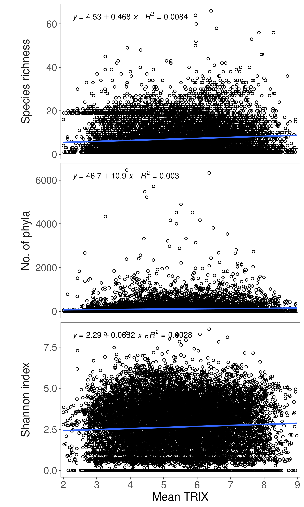

A global assessment of ocean health using the trophic status index
(TRIX)
================
RS-eco

## Abstract

Marine ecosystems are increasingly impacted by anthropogenic activities,
which threatens the future of entire ecosystems. The coastal regions
experience a change in nutrient concentrations of coastal waters through
waste disposal, sewage discharge and runoff. The health of each marine
realm was examined using the trophic status index (TRIX) over a period
of 12 years (2002 - 2015). Mean global TRIX was 5.23, which represents
an overall poor trophic state of the coastal oceans. TRIX was highest in
the Temperate Northern Pacific and lowest in Western Indo-Pacific.

<!-- Annual mean TRIX increased  from 5.93 (± 1.41 SD) in 2002 to 5.42 (± 1.33 SD) in 2015. 
# Currently no significant change over time.
-->

<!-- Some results and discussion are still missing in Abstract! -->

Whilst there are limitations, existing global marine datasets provide
much needed spatio-temporal data that extends over large geographical
areas. These data can help to regulate and control anthropogenic impacts
on the marine environment. <!-- Not exceeding 150 words! -->

**Keywords:** global, pollution, eutrophication, ocean health, trophic
index, ecological indicator.

## Introduction

<!--Halpern2015a and Halpern2015b have weird style, but this should correspond to requirements of Marine Pollution Bulletin.-->

In the last century, marine ecosystems have increasingly been threatened
by anthropogenic activities (Halpern, Frazier, et al., 2015; Halpern et
al., 2008). The major threats to the oceans are: pollution (Beman et
al., 2005), habitat fragmentation or destruction (Cloern, 2001; Sherman
and Duda, 1999), the introduction of invasive species (Bax et al., 2003;
Steneck, 1998), overexploitation of resources (Coll et al., 2008; Pauly
et al., 2008), climate change (IPCC, 2007) and ocean acidification (Orr
et al., 2005). The majority of the world’s population lives within 60 km
of the coast (Kremer et al., 2004) and dramatically alters coastal
ecosystems. Anthropogenic activities that modify riverine hydrology and
material fluxes to coastal waters have increased over the last 200 years
(Le Tissier et al., 2006). As a result, the concentration of nutrients,
sediment and contaminants in coastal waters has increased and nutrient
enrichment of coastal ecosystems has become a serious environmental
issue (Borja and Dauer, 2008; Goberville et al., 2011). At present,
anthropogenic eutrophication has become a worldwide problem in coastal
waters (Gowen et al., 2008), causing loss of seagrass meadows,
occurrence of algal blooms (Anderson et al., 2002), de-oxygenation
(Diaz, 2001) and changes in species composition (Richardson, 1997)
resulting in a regime shift of marine ecosystems. As a consequence, the
need to assess the health and resilience of marine ecosystems has
increased (Hofmann and Gaines, 2008; Rombouts et al., 2013).

The assessment of marine environmental health aims to provide the
necessary information to maintain biodiversity and the integrity of
marine communities, reduce species loss, limit human impact on living
resources, protect critical habitats and safeguard human health (Knap et
al., 2002). This requires understanding of the response of marine
ecosystems to human pressures in contrast to the dynamics of naturally
perturbed ecosystems (Hughes et al., 2005). Marine ecosystems are
complex dynamic systems with multiple non-linear responses, occurring on
various spatial and temporal scales (Levin and Lubchenco, 2008), making
this a challenging task. Furthermore, the state of a perturbed system
might only show a difference to the natural state once a critical
threshold in the exerting pressure has been reached (Rombouts et al.,
2013). Health indicators and indices have been developed to detect early
signs and symptoms of ecosystem deterioration. In order to assess the
health status of an ecosystem an integrative approach, combining
biological, physico-chemical and pollution elements, is required (Borja
and Dauer, 2008; Borja et al., 2010). By now, more than 200 indicators
exist to describe marine ecosystem health (Rice, 2003). However, up to
now ocean health indices have been rarely applied globally. To our
knowledge currently only one global health assessment, using a
socio-ecological index for two consecutive years (2012 & 2013) exists
(Halpern et al., 2012; Halpern, Longo, et al., 2015). However, Halpern,
Longo, et al. (2015) defines a healthy ocean through the lens of coupled
socio-ecological systems as one that sustainably delievers a range of
benefits to people now and in the future, while we concentrate only on
the ecological perspective and set aside the impact on human health.

<!--
@Burt2015 suggested three criteria with regard to upland ecosystem health, namely condition (defined by complement and diversity), process (defined by function and productivity) and durability (defined by the resistance and resilience of an ecosystem on the long run). Burt, Tim P.; Anderson, Penny; Coupar, Andrew; Crowle, Alistair; Fielding, Alan; Gordon, John E.; Marrs, Rob; Slee, Bill; McCracken, Davy; Warburton, Jeff; Werritty, Alan; Thompson, Des B.A. (2015), Upland Ecosystem Health: Defining the indefinable, BES Bulletin Vol46:4

Rapid deterioration of the world’smajor ecosystems has intensified the need for effective environmental monitoring and the development of operational indicators of ecosystem health. Ecosystem health represents a desired endpoint of environmental management, but it requires adaptive, ongoing definition and assessment. We propose that a healthy ecosystem is one that is sustainable – that is, it has the ability to maintain its structure (organization) and function (vigor) over time in the face of external stress (resilience). In this paper, we develop the concept of ecosystem health as a comprehensive, multiscale, dynamic, hierarchical measure of system resilience, organization, and vigor. These concepts are embodied in the term ‘sustainability’ which implies the sys- tem’s ability to maintain its structure (organization) and function (vigor) over time in the face of exter- nal stress (resilience). A healthy system must also be defined in light of both its context (the larger system of which it is part) and its components (the smaller systems that make it up). In its simplest terms, then, health is a measure of the overall performance of a complex system that is built up from the behavior of its parts. Health is also a scale-dependent characteristic. 

A healthy and sustainable systemin this context is one that attains its full expected life span. For individual humans, this is also an often used cumulative indicator of health (at least in retrospect). 

Since ecosystems experience succession as a result of changing climatic conditions and internal developmental changes, they too have a limited (albeit fairly long) life span.

An adequate definition of ecosystem health should integrate the concepts of health mentioned above. Specifically it should be a combined measure of system resilience, life expectancy, balance, organization (diversity), and vigor (metabolism). Second, the definition should be a comprehensive description of the system. Looking at only one part of the system implicitly gives the re- maining parts zero weight. Third, the definition will require the use ofweighting factors to compare and ag- gregate different components in the system. It should useweights for components that are linked to the func- tional dependence of the system’s sustainability on the components, and the weights should be able to vary as the system changes to account for ‘balance’. And fourth, the definition should be hierarchical to account for the interdependence of various time and space scales.

The vigor of a system is simply a measure of its activity, metabolism or primary productivity. The organization of a system refers to the number and diversity of interactions between the components of the system. Measures of organization are affected by the diversity of species, and also by the number of pathways of material exchange between each component. The resilience of a system refers to its ability to maintain its structure and pattern of behavior in the presence of stress (Holling, 1986). In the context of this paper, it may refer to the system’s ability to maintain its vigor and organization in the presence of stress. (Also see Table 1)

It is more difficult to quantify organization than vigor because quantifying organization involves measuring both the diversity and magnitude of system com- ponents and the exchange pathways between them. Diversity indices and multispecies indices fail to in- corporate exchange pathways connecting system components. Network analysis is a potential aspproach to the problem of measuring organization.

One particlar index (AverageMutual Information) may be used as a comprehensive measure of organization. Average Mutual Information (AMI) transcends the traditional diversity indices used in ecology by estimating not only the number of different species in a system, but, more importantly, how they are organized.

Measuring the resilience of a system is difficult be- cause it implies the ability to predict the dynamics of that system under stress. Predicting ecosystemimpacts over time generally requires dynamic simulationmod- els (Costanza et al., 1990). There are two different definitions on resilience in the literature. Pimm (1984) defines resilience as the time it takes for a system to re- cover from stress. Holling (1986) defines resilience as themagnitude of stress beyondwhich the system never recovers its former state. Figure 4 illustrates these two components of resilience (Mageau et al., in press). 

We combine these two ideas into a single measure of resilience. The Recovery Time (RT ) can be estimated simply by measuring the time it takes for a system to recover from a wide variety of stresses to some previous steady state. Mageau et al. (in press) demonstrated how the maximum magnitude of stress (MS) from which a system can recover can be measured by progressively increasing simulated stress until the system reverts to some new steady state, and documenting the magnitude of the stress that caused the shift. We then propose that an overall measure of resilience can be obtained fromthe ratio of MS/RT.

Costanza & Mageau 1999 - What is a healthy ecosystem? Aquatic Ecology 33: 105-115

Ecosystem health is considered by many to be a useful, perhaps essential, concept in formulating ecological policies. Most people envision a healthy ecosystem as being pristine or at least appearing to be minimally altered by human action. Thus, it is argued, ecosystem health is intuitively grasped by the general public, policy officials, and scientists (Meyer 1997). Ecosystem health treats the entire ecosystem as the unit of policy concern. Karr and Chu (1999) argue that the concept of ecosystem health and integrity are fundamentally different. They define ecosystem health as the preferred state of ecosystems modified by human activity (e.g., farmland, urban environments, airports, managed forests). In contrast, ecosystem integrity is defined as an unimpaired condition in which ecosystems show little or no influence from human actions. Ecosystems with a high degree of integrity are natural, pristine, and often labeled as the baseline or benchmark condition. Natural ecosystems, by definition, would continue to function in essentially the same way if humans were removed (Anderson 1991). Although rarely stated clearly, in most formulations of ecosystem health, there is a premise that natural systems are healthier than human-altered systems (Wicklum and Davies 1995). Often, the implicit assumption, or benchmark, is that an undisturbed or natural ecosystem is superior, thus preferred, to an altered one (Anderson 1991). An ecosystem altered by human influences is obviously different from the previous state, but there is no scientific basis for a special ecological state to be considered better (more healthy) and thus the benchmark. Lackey 2001 - Values, Policy and Ecosystem Health, BioScience, Vol. 51 No. 6

From a utilitarian perspective, a desired state of forest health can be considered "a condition where biotic and abiotic influences on forests (e.g., pests, pollution, silvicultural treatments, harvesting) do not threaten management objectives now or in the future" (USDA For- est Service I993a, p. vi). That is, a forest is considered to be healthy if management objectives are satisfied, and unhealthy if they are not.

Such difficulties indicate the need for an ecosystem perspective that emphasizes the basic ecological processes that create and maintain forest conditions to potentially satisfy a range of diverse objectives. For example, "A forest in good health is a fully functioning community of plants and animals and their physical environ- ment" and "A healthy forest is an ecosystem in balance" (Monnig and Byler 1992, p. IC). These statements are a good starting point for thinking about forest health from an ecological perspective. Terms such as "balance" and "function" effectively steer us toward the complex relationships that ecosystems exhibit. However, these definitions specify conditions that can be difficult to understand and measure: In balance with what? What is meant by fully functioning?

Other ecosystem definitions include the idea of resilience: "A healthy forest is one that is resilient to changes" (Joseph et al. 1991, p. 7); "The term forest health denotes the productivity of forest ecosystems and their ability to bounce back after stress" (Radloff et al. 1991, p. 42); or "Forest health can be defined as the ability of a forest to recover from natural and human-caused stressors" (USDA Forest Service 1992, p. 10). While resilience to catastrophic change at the landscape level may be a desired component of a healthy forest, measuring the degree of resilience is difficult.

Haskell et al. (1992) suggest that a healthy ecosystem should be free from "distress syndrome." This syndrome is characterized by reduced primary productivity; loss of nutrient capial; loss of biodiversity; increased fluctuations in key populations; retrogression in biotic structure (a reversal of the normal successional processes whereby opportunistic species replace species more specialized in habitat and resource use); and wide-spread incidence and severity of disease (Rapport 1992).

In the absence of well-defined and widely publicized management objectives that reflect the diversity of values held by society, forest health will continue to be a concern-even with dramatic breakthroughs in scientific understanding of forest ecosystem processes. On the other hand, public expectations must be tempered with the understanding that, in many cases, the range of potential values from forests is limited by biological constraints.

Kolb et al. 1994 - Concepts of forest health: Utilitarian and ecosystem perspectives, Journal of Forestry
-->

### Trophic status index (TRIX)

Sea surface chlorophyll-α (chl-α), a proxy for autotrophic phytoplankton
biomass, can be regularly derived from satellite imagery, but is not an
expression of production dynamics *per se*. Variation in oxygen
saturation can be used as an indiator for the productivity of a system,
as productive systems show a noticeable variation in oxygen saturation,
while systems with a low productivity do not. Total nitrogen and total
phosphorus are the most representative parameters of nutrients in the
water and thus are the drivers ocean productivity (Vollenweider et al.,
1998). Thus, Vollenweider et al. (1998) proposed a composite trophic
status index (TRIX) in order to identify the state of coastal marine
environments, which is a linear combination of four routinely measured
variables: chl-α, total nitrogen, total phosphorus and absolute
deviation of % oxygen saturation (aD%O). The mean and standard deviation
of each of the four components is calculated and data points exceeding
mean ± 2.5 standard deviation are removed. The data is log-transformed
and standardised to 3 log units and TRIX is then calculated using the
following equation:

1)  \[TRIX = \frac{k}{n}\sum_1^{i=n}[\frac{(log M - log L)}{(log U - log L)}]_i\]

where k = 10 (scaling the result between 0 and 10), n = 4 (number of
variables that are integrated), Mi = measured value of variable i, Ui =
upper limit of variable i, Li = lower limit of value i. The resulting
values for TRIX range between 0 and 10 and represent the trophic level
of coastal waters from oligotrophic to eutrophic conditions. The value
is dependent on the upper and lower limit of each variable and indicates
how close the current state is to the average condition (Giovanardi and
Vollenweider, 2004; Vollenweider et al., 1998). Chl-α concentration and
absolute deviation from dissolved oxygen saturation are indicators of
productivity, while TN and TP are indicators of nutrients (Artioli et
al., 2005). A low TRIX value indicates a high-quality while a high TRIX
value indicates a low-quality condition (Giovanardi and Vollenweider,
2004; Penna et al., 2004). TRIX can also be used as an indicator of
trophic state, where 2 =\< TRIX \< 4 = good and above, 4 =\< TRIX \< 5 =
moderate, 5 =\< TRIX \< 6 = poor and 6 =\< TRIX \< 8 = bad trophic state
(Artioli et al., 2005).

So far, TRIX has been applied to long-term datasets of specific
locations and to investigate small-scale spatial patterns. It has been
used in the Adriatic and Tyrrhenian Sea (Artioli et al., 2005;
Giovanardi and Vollenweider, 2004; Pettine et al., 2007; Vollenweider et
al., 1998), in the Lagoon of Venice (Bendoricchio and De Boni, 2005),
the Ligurian Sea (Mangialajo et al., 2007; Pettine et al., 2007), the
Mar Menor lagoon (Spain), the Mondego estuary (Portugal) (Salas et al.,
2008) and the Foz de Almargem coastal lagoon (Algarve, South Portugal)
(Coelho et al., 2007), as well as the Marmara Sea (Balkis et al., 2012),
the Black Sea (Moncheva et al., 2002; Parkhomenko et al., 2003), the
eastern Aegean coast (Yucel-Gier et al., 2011) and around southeast
Mexico (Herrera-Silveira and Morales-Ojeda, 2009). So far, all studies
have used the reference conditions of the Mediterranean Sea calculated
by Vollenweider et al. (1998) to maintain the general utility of TRIX.
Salas et al. (2008) found that the use of TRIX, using the Mediterranean
reference conditions, is restricted to these waters, while Coelho et
al. (2007) and Salas et al. (2008) suggested the use of habitat
specific classification criteria for TRIX, if the index is applied over
wide areas.

To our knowledge, this is the first study assessing the health of our
oceans using a single ecologial indicator based on readily available
data. Reference conditions for TRIX were calculated for each of the 12
marine realms in the world to derive habitat specific classification
criteria. The health of the world’s oceans was assessed using a
temporally-averaged TRIX, but also by calculating TRIX globally over 14
years (2002 - 2015). The validity of TRIX was further tested using three
anthropogenic impact variables, Food and Agriculture Organization (FAO)
fishery landings data and Ocean Biogeographic Information System (OBIS)
biodiversity data.

## Methodology

### Environmental data

Data on total nitrogen (TN) and total phosphorus (TP) is rarely
routinely measured (Vollenweider et al., 1998) and thus not available on
a global basis. Nitrate and phosphate are each a major constituent of TN
and TP and are more commonly measured. Thus, we used nitrate and
phosphate due to data availability, instead of TN and TP as originally
proposed by Vollenweider et al. (1998), to calculate TRIX. Global
nitrate (μmol/l), phosphate (μmol/l), dissolved oxygen (ml/l),
temperature (°C) and salinity (PSU) data was obtained from the publicly
available World Ocean Database 2013 (WOD2013)
(<https://www.nodc.noaa.gov/OC5/SELECT/dbsearch/dbsearch.html>) (Boyer
et al., 2013). The WOD2013 is compiled from global *in situ* measured
oceanographic data from 1955 up to 2015, however in this study only data
from 2002 - 2015 was used.
<!-- Mention number of data points for each variable and each year? -->

Annual global sea surface chl-α (mg/m3) data obtained from L3
processed products of the Aqua Moderate Resolution Imaging
Spectroradiometer (MODIS) satellite was available from the National
Aeronautics and Space Administration (NASA) OceanData Portal
(<https://oceancolor.gsfc.nasa.gov/cgi/l3/>). This dataset contained
annually averaged data from 2002 - 2015, at a spatial resolution of \~ 9
km and was processed using the OCI algorithm.

### Data Analysis

<!-- Need Weiss1970 Reference -->

<!-- Adapt section below, need to talk about yearly interpolation as well. Change order, first talk about aD%O, than about interpolation just like code. -->

The WOD2013 data was interpolated to a global raster with a resolution
of 1 degree. The data was than resampled to the higher resolution of the
chlorophyll data in order to have data with the same spatial resolution,
but retain the spatial resolution of the chlorophyll data. Temperature,
salinity and dissolved oxygen were used to calculate the absolute
deviation of % oxygen saturation (aD%O). aD%O depends on temperature and
salinity. First, the oxygen solubility was calculated using the
following equation proposed by (Weiss 1970):

2)  \[ ln C* = A_1 + A_2(100/T) + A_3 ln(T/100) + A_4(T/100) + \\ S [B_1 + B_2(T/100) + B_3(T/100)^2] \]

where C\* = the solubility in ml/l from water saturated air at a total
pressure of one atmosphere, T = the absolute temperature in Kelvin (T °C
+ 273.15) and S = the salinity in PSU. A’s and B’s are volumetric
solubility constants and depend on the gas and the solubility unit. For
O2 in (ml/l): A1 = -173.4292, A2 =
249.6339, A3 = 143.3483, A4 = -21.8492,
B1 = -0.033096, B2 = 0.014259, B3 =
-0.0017000 (Weiss 1970). aD%O was then calculated by:

3)  \[ aD\%O = | 100 - \frac{1}{100} * \frac{dissox}{C*} | \]

where dissox = the concentration of dissolved oxygen and C\* = the
oxygen solubility (Vollenweider et al. 1998).
<!--Nitrate and phosphate were converted from (μmol/l) to (mg/l).-->

TRIX was calculated for the world’s coastal oceans by deriving specific
reference conditions for each of the 12 world’s marine realms (Arctic,
Central Indo-Pacific, Eastern Indo-Pacific, Southern Ocean, Temperate
Australasia, Temperate Northern Atlantic, Temperate Northern Pacific,
Temperate South America, Temperate Southern Africa, Tropical Atlantic,
Tropical Eastern Pacific, Western Indo-Pacific) (see Table 1). Marine
realms are a large-scale classification of coastal and shelf areas into
regions, where biotas are internally coherent at higher taxonomic
levels, as a result of a shared and unique evolutionary history which is
driven by water temperature, historical and broadscale isolation, and
the proximity of the benthos (Spalding et al. 2007). The outline of the
marine realms was downloaded from
<http://www.marineregions.org/download_file.php?name=MEOW.zip>. The
dataset was masked by the Marine Ecoregions of the World (MEOW) and for
each marine realm the mean and standard deviation of each environmental
variable was than extracted. Data points within each marine realm that
exceeded mean ± 2.5 standard deviation (SD) were discarded. The
remaining data was log-transformed and standardised to 3 log units. The
maximum and minimum log-value of each environmental variable was used as
reference condition. The mean of the annual chl-α, nitrate and phosphate
data was calculated (see Supplementary Figure 1) and used to calculate
temporally-averaged reference conditions for each marine realm (Table 1)
and temporally-averaged TRIX for the world’s coastal oceans (Fig. 1).
The change in TRIX with latitude was assessed (Fig. 2). TRIX was further
classified into the 4 trophic state categories (good and above,
moderate, poor and bad), according to Artioli et al. (2005) (Fig. 1b).
Annual TRIX was calculated for the world’s coastal oceans from 2002 -
2015 (Figure 3 & 4) using the annual nitrate, phosphate, aD%O and chl-α
data (see Supplementary Figure 3, 4, 5, 6, 7, 8, 9 & 10).

### Socio-economic data

Transformed direct place-based impact of shipping traffic frequency,
organic pollution quantity and ocean based pollution was extracted from
Halpern et al. (2008)
(<https://www.nceas.ucsb.edu/globalmarine2008/impacts>). Each pollution
type has been normalised to a scale between 0 and 1. Only anthropogenic
impact data of each marine realm was kept and the remaining data was
resampled to the same resolution as the chl-α data (see Supplementary
Figure 11). To assess the impact of these variables on TRIX we applied a
regression model between each of these variables and TRIX (Fig. 7, Table
2).

<!-- Dropped some variables (...) -->

<!-- Raw data for 2008 and 2013 available from: https://knb.ecoinformatics.org/#view/doi:10.5063/F1S180FS, refering to Halpern2015. -->

<!--These 6 anthropogenic impact variables were re-projected to WGS 1984, masked to the MEOW shapefile and resampled to the lower resolution of the environmental data.-->

<!-- Mention the resolution of the Halpern data. -->

he protected areas of each marine realm were obtained from the World
Database on Protected Areas (IUCN and UNEP-WCMC, 2017). Only marine
protected areas (MPAs) with a defined spatial extent and an IUCN
category were considered. The mean and standard deviation of TRIX was
compared among protected and non-protected areas for each marine realm
(Fig. 8).

Marine biodiversity summary statistics were obtained from OBIS
(<http://www.iobis.org/geoserver/OBIS/ows?service=WFS&version=1.0.0&request=GetFeature&typeName=OBIS:summaries&viewparams=table:map1deg_with_geom&outputformat=shape-zip>).
This layer contains various statistics and biodiversity indices (number
of species, number of phyla and shannon index) per 1 degree grid cell
(OBIS, 2016) (see Supplementary Figure 13). Mean TRIX for each grid cell
was extracted and again a linear regression model was applied between
each of the biodiversity indices and TRIX (Fig. 9).
<!-- Dropped number of records, simpson index and Hulbert Biodiversity index (ES50) -->

Annual global capture fishing landings per country for the years 2002 -
2015 were obtained from the Food and Agriculture Organization of the
United Nations \[\]. The outline of each exclusiv economic zone (EEZ)
was obtained from Marineregions.org. The annual mean TRIX for each EEZ
was calculated. Mean TRIX and fishery landings for each year were than
merged for each EEZ and country using the respective ISO3-code and again
a linear regression model was applied to investigate the relationship
between TRIX and fishery landings (Fig. 10).
<!-- Add new Reference according to FAO Website -->
<!-- Adapt section, Fisheries data was obtained from FAO Website, see Code! [@Ram2016] -->

The entire analysis was performed in R Version 3.4 (R Core Team, 2020)
using the following spatial R packages: `maptools` (Bivand and
Lewin-Koh, 2016), `raster` (Hijmans, 2016), `rgdal` (Bivand et al.,
2016), and `rgeos` (Bivand and Rundel, 2016). The R Script of the entire
analysis can be found in the Supplementary Material.

## Results

### Spatial patterns

Mean chl-α concentration ranged from NA mg l-1 to NA mg
l-1 and had a mean of NA mg l-1. Mean chl-α was on
average highest in the Arctic (2.13 ± 2.92) and lowest in Eastern
Indo-Pacific (0.08 ± 0.05). Mean nitrate concentration ranged from NA to
NA mg l-1 and had a mean of NA mg l-1. Mean
nitrate was on average highest in the Southern Ocean (1.44 ± 0.25) and
lowest in Tropical Atlantic (0.01 ± 0.02). Mean phosphate concentration
ranged from NA to NA mg l-1 and showed a mean of NA mg
l-1. Mean phosphate was on average highest in the Southern
Ocean (0.15 ± 0.03) and lowest in Tropical Atlantic (0 ± 0). Mean aD%O
ranged from NA to NA % and had a mean of NA %. Mean aD%O was on average
highest in the Temperate Southern Africa (50.06 ± 22.81) and lowest in
Arctic (25.18 ± 4.58).

Reference conditions greatly varied among the different marine realms.
Minimum chl-α ranged from  to - and maximum chl-α from  to -. Minimum
nitrate ranged from  to - and maximum nitrate from  to -. Minimum
phosphate ranged from  to - and maximum phosphate from  to -, while
minimum aD%O ranged from  to - and maximum aD%O from  to - (Table 1).
<!-- Spatial pattern in reference conditions? (plot of min and max reference conditions), Differences in ref condition among marine realms? (Plot range per reference condition and marine realm) -->

Global TRIX ranged from 0.88 to 9.63 and had a mean of 5.23 (± 1.36 SD).
Indicating an overall poor trophic state of the world’s coastal oceans
(Fig. 1). TRIX increased with increasing latitude. The lowest TRIX
values were found at areas of mid-latitude (around 30°North & 30°South)
(Fig. 2).

Among the different marine realms TRIX was highest (bad health) in the
Temperate Northern Pacific (Mean TRIX = 6.52 ± 1.09 SD) and lowest (good
health) in the Western Indo-Pacific (Mean TRIX = 4.48 ± 1 SD) (Table 1).

As expected TRIX showed a significant log-linear relationship with all
four individual component variables. Phosphate was the environmental
variable that explained most of the variation in TRIX, with an adjusted
R2 of 0.56 (Supplementary Figure 2).

22.6 % of the coastal ocean showed a good and above trophic state (2 =\<
TRIX \< 4), while 27.92 % of the coastal ocean had a moderate trophic
state (4 =\< TRIX \< 5). Poor trophic state (5 =\< TRIX \< 6) was found
in 25.82 % of the coastal ocean and 30.37 % of the coastal ocean had a
TRIX greater or equal than 6 and less than 8 (bad trophic state). Marine
realms with a poor trophic state were NA, NA, NA, NA, NA, NA, NA, NA,
NA, NA, NA, NA, while marine realms with a bad trophic state were NA,
NA, NA, NA, NA, NA, NA, NA, NA, NA, NA, NA (Fig. 1b).
<!-- Create a figure with just the mean trophic state by marine realm, check comment in code for IDs -->

### Spatio-temporal patterns

Annual chl-α varied considerably over time and space (Supplementary
Figure 3 & 4). Annual mean chlorophyll showed a significant increase
over time (p \< 0.05) from 0.74 (± 1.92 SD) to 0.99 (± 2.17 SD) (Fig.
3). Among the individual marine realms showed a significant increase in
chl-α from 2002-2015, while showed a significant decrease in TRIX (see
Supplementary Figure 3 & 4).

Annual mean nitrate showed a increase over time from 0.35 (± 1.07 SD) to
0.41 (± 0.23 SD) (Fig. 3). Among the individual marine realms showed a
significant increase in nitrate from 2002-2015, while showed a
significant decrease in TRIX (see Supplementary Figure 3 & 4).

Annual TRIX also varied considerably over time and space (Supplementary
Figure 6 & 7). Annual mean TRIX showed a increase over time (Fig. 3)
from 5.93 (± 1.41 SD) in 2002 to 5.42 (± 1.33 SD) in 2015. Within each
marine realm mean TRIX also varied over time. showed an increase in TRIX
from 2002-2015, while showed a decrease in TRIX. However, none of these
changes were significant (Fig. 4).
<!-- Sentence about significance really true? -->

<!-- Which marine realms showed a positive and which a negative trend? - Does change in code work properly??? -->

### Validation

Organic pollution had a mean impact of …, ocean-based pollution a mean
impact of … and shipping traffic had a mean impact of … within marine
realms. Organic pollution was highest in … and lowest in … . Ocean-based
pollution was highest in .. and lowest in … and shipping traffic impact
was highest in … and lowest in … . Overall, … was the marine realm with
the largest mean cumulative impact (… +- SD), while the marine realm
with the lowest cumulative impact was (… +- SD) (Supplementary Fig. …).
<!-- Mean impact of each variable per marine realm -->

Chl-α, nitrate, aD%O and TRIX showed a significant (p \< 0.05) linear
relationship with all 3 anthropogenic impact variables (organic
pollution, ocean-based pollution and shipping traffic). Phosphate showed
a significant linear relationship with all variables apart from the
organic pollution quantity impact (Table 2). TRIX always decreased with
increasing anthropogenic impact (Fig. 5), while the environmental
variables strongly varied in their response to the individual
anthropogenic impact variables (Supplementary Figure 9).
<!-- Is this still true? Especially after change of analysis with just 2008 data. -->

11.27 % of the area investigated was covered by MPAs. Temperate
Australasia was the marine realm with the largest area under protection
(25.71 %), while the marine realm with the smallest areal percentage of
MPAs was Western Indo-Pacific with only 0.85 % under protection.

TRIX only differed very little between protected and unprotected areas.
In 7 marine realms (Central Indo-Pacific, Eastern Indo-Pacific, Southern
Ocean, Temperate Australasia, Temperate South America, Temperate
Southern Africa, Tropical Eastern Pacific) TRIX was significantly higher
in unprotected areas compared to protected areas (p \< 0.05). While, in
the other 5 marine realms (Arctic, Temperate Northern Atlantic,
Temperate Northern Pacific, Tropical Atlantic, Western Indo-Pacific)
TRIX was significantly higher in protected areas compared to unprotected
areas (p \< 0.05) (Fig. 6).

<!-- Talk about marine realm with highest and marine realm with lowest biodiversity! - same as for Halpern-->

Of the OBIS data, the number of records, species richness, Simpson index
and the number of phyla increased significantly (p \< 0.05) with
increasing TRIX and only the Shannon index and ES50 significantly (p \<
0.05) decreased with increasing TRIX (Fig. 7).
<!-- Check results of m_obis to see if all models really were significant. -->
<!-- 
What does Shannon index and ES50 tell us, I believe a low Shannon index represents a high biodiversity, but what about ES50? The ES50 represents the expected number of species in a random sample of 50 records => Varies from 1 - 50.
-->

Total fishery landings (mio tonnes) significant decreased from
7.721511810^{7} in 2002 to 7.450014510^{7} in 2015. Annual mean TRIX per
country showed a positive relationship with log fishery landings (Fig.
8).

<!-- 
Of the 0 countries of which data was available only ... showed a significant decrease, while ... countries (which countries)) 
showed a significant increase in fishery landings. Need to write code for this!
-->

## Discussion

<!-- How does the pattern in environmental conditions relate to existing literature??? - mention in Discussion -->

<!-- How does biodiversity (Number of records, number of species, number of phyla, shannon index, simpson index, ES50) relate to health? -->

<!-- Why fisheries? How does this relate to ocean health? How does this compare to artisanal fishing rates from Halpern? What is the difference?-->

This is the first study applying the trophic status index (TRIX),
combining biological and physico-chemical variables, on a global scale.
The component variables of TRIX can be directly measured and are
routinely collected, which would make it a suitable index for large
scale ocean health assessments (Giovanardi and Vollenweider, 2004).
<!-- Comparison of environmental data values with literature, Bio-Oracle?/Mar-Spec?-->

Salas et al. (2008) argued that TRIX is inefficient in the
classification of the eutrophication status due to the combination of
parameters that are not completely independent. Previous studies have
only applied TRIX using the reference conditions from the Mediterranean
Sea, which were originally calculated by Vollenweider et al. (1998).
Hence, they did not take type-specific reference conditions into account
and so did not fulfil the selection criteria of the Water Framework
Directive (Pettine et al., 2007; Salas et al., 2008). Using health
indices that require type-specific reference conditions would require an
enormous effort if used in order to make a global health assessment.

Nevertheless, we have tried this, by calculating individual reference
conditions for each marine realm of the world. Minimum reference
conditions for the Temperate Northern Atlantic marine realm were: chl-α
= -2.55, nitrate = -7.87, phosphate = -6.82 and aD%O = 2.47. Maximum
reference conditions were: chl-α = 2.24, nitrate = 1.5, phosphate =
-1.68 and aD%O = 3.94. The minimum reference conditions for the
Mediterranean Sea calculated by @Vollenweider1998 were: chl-α = -0.5,
total nitrogen = 0.5, total phosphorus = -0.5, aD%O = -1. Maximum
reference conditions were: chl-α = 2.5, total nitrogen = 3.5, total
phosphorus = 2.5, aD%O = 2. This shows a huge discrepancy in the
reference conditions, however this could be due to the fact that we
considered a much larger area and much coarser data set for our
calculations. In this study, nitrate and phosphate were used instead of
total nitrogen and total phosphorus, as nitrate and phosphate data were
readily available from the WOA2013 dataset. The WOA2013 dataset further
contains data that is averaged over time and space, which may have
confounded our results, while Vollenweider et al. (1998) used high
resolution time-series data of one specific point to calculate reference
conditions.

<!--
Description of general global ocean health patterns!!!
-->

Our results further show that the trophic state of the coastal ocean is
mostly in a bad or poor state with only a few moderate or good areas
(Fig. 1b). While, the global ocean health index calculated by Halpern et
al. (2012) showed that most countries scored an index of moderate health
with only a few showing high health.

TRIX was lower around the equator and higher around the poles,
indicating a low health around the poles and a better health around the
equator (Fig. 1a). Halpern et al. (2008) calculated the human impact on
marine ecosystems and found that the areas near the poles are the only
areas where little human impact remains. Thus, we would assume the ocean
health is generally better around the poles than the rest of the globe.
However, Hansen et al. (2006) found that sea surface temperature is
changing more rapidly at higher latitudes than around the equator,
suggesting that the poles face a much larger impact than areas of lower
latitude.

Several hotspots of cumulative impact exist, most notably in the North
Sea and South and East China Seas. The many stressors associated with
climate change (anomalously high sea surface temperatures, ocean
acidification and increasing ultraviolet radiation) dominate humanity’s
footprint on the open ocean, but commercial fishing and shipping also
cover large areas of the oceans and contribute significantly to overall
impact. In nearshore coastal waters, stressor combinations are more
complex and varied. National waters currently experiencing highest
estimated impacts include those off Singapore, Jordan, Slovenia and
Bosnia, while the most impacted coastal ecoregions include the Faroe
Islands, Eastern Caribbean, Cape Verde and Azore islands. Least impacted
geographic areas are primarily in the poles, but also include relatively
large areas in the central Pacific like the waters surrounding Jarvis
Island and Palmyra Atoll (USA) and the Line Group of Kiribati, as well
as temperate ecoregions around Argentina and the northeast Pacific
(Halpern, Frazier, et al., 2015).
<!-- Need to rewrite this, as copied from paper. -->

In 2013, the ten highest scores were all obtained by island territories
or nations, including Howland Island and Baker Island, Prince Edward
Islands, Heard and McDonald Islands, Macquarie Island, Kerguelen
Islands, Jarvis Island, Crozet Islands, Greenland, Johnston Atoll and
Malta. Five of these regions are in the southern hemisphere, either
uninhabited or with small populations, and three of the others are
tropical island nations or territories.

<!--
1) Why are poles unhealthy compared to equatorial and highly populated areas? 
It has to be nutrient levels? 

Overall, countries with greater increases in coastal population had larger 5-year changes in cumulative impacts. Absolute coastal population size was unrelated to change in cumulative impact. Nevertheless, many places that are largely uninhabited or have relatively low population densities still experienced large increases in impacts, suggesting that population size may not always drive decreases in ecological conditions [@Halpern2015b].

More discussion needed on how the variables affect the outcome.
Why is this? Is it because these are nutrient rich, whilst equator is nutrient poor?
-->

<!-- 
What are downsides of TRIX:

Linear combination!
==> Marine ecosystems are complex dynamic systems with multiple non-linear responses, occurring on various spatial and temporal scales [@Levin2008], making this a challenging task. 

Nitrate and nitrogen/Phosphate and phosphors not comparable.
=> Among the causative factors, total nitrogen and total phosphorus are the most representative parameters. Yet, total nitrogen is often not routinely measured. Mineral components, instead, are usually measured, and may be taken as substitute for the totals. The same would apply to total and dissolved mineral phosphorus, but substitution of mineral phosphorus for totals is more questionable. Nutritional factors: Total Nitrogen (NT), Total phosphorus (PT), Dissolved inorganic nitrogen (DIN) as N-(NO3+NO2 + NH3), Dissolved inorganic phosphorus (DIP) as P-PO4. The components are selected according to availability of data. The desirable combination are: NT and PT, DIN and PT and DIN and DIP, in this order; the least desirable, NT and DIP, instead is of little interest.
-->

Phosphate (True?) was the environmental variable, which explained most
of the variation in TRIX, while … was the variable with the least
explanatory information (Fig. …).

<!-- 
disccusion what phosphate does!.
Mineral components, instead, are usually measured, and may be taken as substitute for the totals. The same would apply to total and dissolved mineral phosphorus, but substitution of mineral phosphorus for totals is more questionable.
Substitution of phosphate more questionable but explains most of the variation in TRIX???
-->

<!--
TRIX showed a significant linear relationship with all four individual component variables, suggesting that TRIX depicts the variation of all four individual component variables. Although, composite indices provide a way to simplify complex system, care needs to be taken when the results are used, as every index is subjective and fine-scale information are often lost [@Borja2011].
-->

Annual mean chl-α increased from 2002 - 2015 (Fig. 3), indicating a
global increase in eutrophication over this time period. This also
reflects the results of Neal et al. (2000), who reported an increase in
eutrophication over the last 30 years. However, looking at the mean
annual chl-α for each marine realm no clear trend was observed
(Supplementary Figure 5). Annual mean TRIX increased from 2002 - 2015
(Fig. 3), but no clear spatio-temporal pattern was observed
(Supplementary Figure 6 & 7). This implies a decrease in ocean health,
which is what we would expect due to an increase in anthropogenic
activities over the last century (Borja and Dauer, 2008; Goberville et
al., 2011; Halpern et al., 2008; Le Tissier et al., 2006).
<!-- + Selman2008 in last Reference. -->
<!-- This calls for a map with significant changes in TRIX and Chlorophyll, just like in MSc thesis.-->

From 2008 to 2013 nearly 66 % of the ocean experienced increases in
cumulative impact. Increases tended to be located in the tropical,
subtropical and coastal regions, with average increases in 77 % of all
EEZs. In contrast, only 13% of the ocean experienced decreases (Halpern,
Frazier, et al., 2015). Several areas of very high impact (North Sea,
Mediterranean Sea and East China Sea) experienced decreases in
cumulative impact, while many offshore regions in the subtropical
Atlantic and Indian Oceans that previously had relatively low impact
scores saw large increases (Halpern, Frazier, et al., 2015).

<!-- Additiona literature from Halpern2015b: Butchart 2011 - Global biodiversity: indicators of recent declines. Halpern et al. 2009 - Mapping human impacts to California Current marine ecosystems. Micheli et al. 2013 - Cumulative human impacts on mediterranea and black sea marine ecosystems: assessing current pressures and opportunities. Tittensor et al. 2010 - Global patterns and predictors of marine biodiversity across taxa. Selig et al. 2014 - Global priorities for marine biodiversity conservation. Halpern et al. 2010 - Placing MPAs onto the ecosystem-based management seascape. Halpern et al. 2009 - Global hotspots of land-based impacts to coastal marine ecosystems. Halpern et al. 2007 - Evaluating and ranking the vulnerability of global marine ecosystems to anthropogenic threats. (http://www.vliz.be/vmdcdata/marbound) -->

Worldwide, Index scores remained largely unchanged from the 2012
assessment, with countries generally showing at most one to two points
difference (Fig. 1b, TableMin S1 File). This is not surprising, as the
overall composite Index scores, especially at very large scales, should
not change much from year-to-year unless dramatic negative (such as an
environmental disaster) or positive (such as a large-scale conservation
effort) changes occur in the system. Further- more, data layers that do
not have updated values dampen changes in scores. The countries with the
largest change in Index scores were small regions where a relatively
large area was set aside within a Marine Protected Area (South Georgia
and South Sandwich Islands) or countries where individual goal scores
dropped dramatically (e.g., natural products in Cook Islands) due to a
large decrease in ornamental fish and shell harvest (Halpern, Longo, et
al., 2015). <!-- Include in paper -->

Chl-α, nitrate, aD%O and TRIX showed a significant (p \< 0.05) linear
relationship with all 6 anthropogenic impact variables (artisanal
fishing, inorganic pollution, invasive species, organic pollution,
ocean-based pollution and shipping traffic). Phosphate showed a
significant linear relationship with all variables apart from the number
of invasive species impact and organic pollution quantity (Table 2).
TRIX decreased with increasing anthropogenic impact (Fig. 5), while the
environmental variables strongly varied in their response to the
individual anthropogenic impact variables (Supplementary Figure 9).
<!-- Discuss this -->

The lack of correlation for nearly all pairwise comparisons of goal
scores (Fig. 4) suggests that there is low redundancy across goal
indicators. In other words, a subset of goals would not easily deliver
the same information, demonstrating the utility of measuring multiple
facets of ocean health simultaneously through a range of public goals
(Halpern, Longo, et al., 2015).
<!-- Include here! Halpern uses a correlation matrix for this, might be nicer than the linear regression plots. -->

TRIX only differed very little between protected and unprotected areas.
In 7 marine realms (Central Indo-Pacific, Eastern Indo-Pacific, Southern
Ocean, Temperate Australasia, Temperate South America, Temperate
Southern Africa, Tropical Eastern Pacific) TRIX was higher in
unprotected areas compared to MPAs. While, in the other 6 marine realms
(Arctic, Temperate Northern Atlantic, Temperate Northern Pacific,
Tropical Atlantic, Western Indo-Pacific) TRIX was higher in MPAs
compared to unprotected areas (Fig. 6).

Partelow et al. (2015) found that the majority of MPAs is currently
affected by pollution and is likely to increase in the future. Current
pollution is mostly coming from place-based terrestrial sources, while
the analysis of Partelow et al. (2015) suggests that increases in sea
surface temperature, UV light penetration, and ocean acidification are
likely to have a stronger impact on MPAs than the current pollution
exposure of shipping frequency, ocean based pollution, organic and
inorganic pollution, artisanal fishing and invasive species.

<!--
Watersheds accumulate terrestrial pollutants and concentrate the inputs into marine environments at specific locations through river outlets, wetlands and estuaries (Crain et al. 2009). These pollutants often disperse into marine ecosystems across the local to regional level (Halpern et al. 2008). Human constructed pollution sources include water drainages, harbors, sewage and industrial outputs [@Partelow2015]. The spatial origin and distribution of land-based pollution, as well as the processes of its accumulation in marine environments over time, should inform MPA design and management processes. 

Key factors for the success of an MPA are enforcement, large size, old age, isolation (relative location) and full protection (Edgar et al. 2014).

MPAs cannot mitigate the direct sources of healthy marine ecosystems. However, healthy baseline marine ecosystems are more resilient to climate change (Hoegh-Guldberg and Bruno 2010) and provide more ecosystem services to support society and ecosystem integrity (Worm et al. 2006) [@Partelow2015].
-->

Of the OBIS data, the number of records, species richness, Simpson index
and the number of phyla increased with increasing TRIX and only the
Shannon index and ES50 decreased with increasing TRIX (Fig. 7).
<!--Need to explain how biodiversity relates to health, in discussion???-->

Annual mean TRIX per country showed a increase with log fishery landings
(Fig. 8).

<!-- Does validation proof TRIX is good or not? -->

Index scores tended to be higher in countries or regions with higher HDI
scores (Fig. 4A; TableN in S1 File) according to the best performing
model (i.e., lowest BIC). There was some evidence that GDP and
population may also be correlated with Index scores. Population is
neg-atively correlated with Index scores when analyzed by itself (Fig.
4B), and according to AIC scores, models including HDI and GDP performed
slightly better than models with only HDI (with a positive correlation
between GDP and Index scores; Table Nin S1 File). However, add-ing
population or GDP into a model with HDI only slightly increased the
amount of variance explained by the model (Table N in S1 File,R2
values), suggesting that HDI, by far, is the best predictor of Index
scores. Goal scores showed remarkably little correlation with each
other, with only twelve pairs of goals showing highly significant
correlations (p\<0.01) and an additional three significant at p\<0.05
(Fig. 4). The strongest correlations were for biodiversity with carbon
storage and coastal protection, clean waters with artisanal fishing
opportunities, and carbon storage with coastal protection (Halpern,
Longo, et al., 2015). <!-- Add this to validation discussion! -->

<!--
Our results show that TRIX is not able to predict in of TRIX on a large scale (EEZ), when using individually calculated reference conditions. 

There needs to be more discussion on the actual results as well, what lessons can be learned from using TRIX in this manner? More on which areas are "healthy" and which are "unhealthy".
-->

Many countries around the world have enacted policy encouraging or
mandating actions that promote sustainable ocean ecosystems. In
particular, the European Union has set an objective of ‘good
environmental status’ \[5\], and the United States and Australia both
have stated objectives of ‘healthy oceans’ that focus on environmentally
sustainable development \[1,6\] (Halpern, Longo, et al., 2015).

<!-- Make a final conclusion and then provide a future outlook! -->

Whilst there are limitations, modeled and interpolated environmental
datasets provide much needed spatio-temporal data that extends over
large geographical areas and thus should be considered for the
assessment of marine ecosystem health. These data can help to improve
management strategies that regulate anthropogenic impacts on the marine
environment and provide evidence that better management of marine
ecosystems on a global scale is needed.
<!-- Need to combine this two paragraphs into one!-->

Better spatio-temporal datasets are needed in order to capture the
dynamics and functions of marine ecosystems and to identify the response
to anthropogenic impacts (Dobson et al., 1997; Hildén and Rapport,
1993). For the future, we suggest the frequent use of spatio-temporal
field observations to improve ecosystem health assessments and thus
provide data that could be used to develop sound management strategies
(Rombouts et al., 2013).

<!--
Suggest improvements: Better data, Comparison of indices, Indicator species???
Mention death zones - Levin
Talk about advances in ocean colour measurements, increased resolution (OLCI, ...)
-->

## Figures

**Fig. 1.** A) Trophic index (TRIX) of the world’s coastal oceans using
specific reference conditions calculated for each marine realm. Lower
values of TRIX indicate healthier oceans. B) Trophic state of the
world’s coastal ocean.

**Fig. 2.** Scatterplot and linear regression of trophic index (TRIX)
against latitude.

**Fig. 3.** Annual TRIX for the time period 2002-2009, WGS1984
projection.

**Fig. 4.** Annual TRIX for the time period 2010-2015, WGS1984
projection.

**Fig. 5.** Time series of mean chl-α , nitrate, phosphate, aD%O and
mean trophic index (TRIX) from 2002-2015.

 **Fig. 6.** Relationship of species richness,
number of phyla and shannon index with mean TRIX.

**Fig. 7.** Relationship of annual TRIX and log fishery Landings (t) per
EEZ.

<!-- Linear regression of organic pollution, ocean based pollution and shipping with the trophic index TRIX.  
Time series of mean trophic index (TRIX) for each marine realm from 2002-2015. -->

 **Fig. 8.** Boxplot of TRIX for protected and
unprotected sites within each marine realm.

# Tables

**Table 1.** Reference conditions and mean trophic index (TRIX) for each
marine realm.

|        Marine realm         | Min Chl-a | Min Nit | Min Pho | Min aD%O | Max Chl-a | Max Nit | Max Pho | Max aD%O | Mean TRIX |  NA  |
| :-------------------------: | :-------: | :-----: | :-----: | :------: | :-------: | :-----: | :-----: | :------: | :-------: | :--: |
|           Arctic            |  \-1.33   | \-5.96  | \-5.49  |   2.65   |   2.24    |  0.01   | \-2.09  |   3.59   |   5.65    | 0.97 |
|    Central Indo-Pacific     |  \-3.28   | \-6.34  | \-6.96  |   3.17   |    0.6    | \-0.86  | \-3.26  |   3.84   |   4.48    | 0.97 |
|    Eastern Indo-Pacific     |  \-3.65   | \-6.38  | \-6.83  |   2.83   |  \-1.62   | \-1.28  | \-2.98  |   4.05   |   5.35    | 1.54 |
|       Southern Ocean        |  \-2.77   | \-0.22  | \-2.49  |   2.97   |   0.59    |  0.61   | \-1.63  |   3.78   |   5.99    | 1.08 |
|    Temperate Australasia    |  \-2.43   | \-6.25  |  \-5.4  |   2.83   |   0.24    |  0.31   | \-2.43  |   3.94   |   4.74    | 1.53 |
| Temperate Northern Atlantic |  \-2.55   | \-7.87  | \-6.82  |   2.47   |   2.24    |   1.5   | \-1.68  |   3.94   |    5.3    | 1.19 |
| Temperate Northern Pacific  |  \-2.25   | \-5.75  | \-6.16  |   2.78   |   1.66    |  0.23   | \-1.66  |   3.77   |   6.52    | 1.09 |
|   Temperate South America   |  \-2.41   | \-5.77  | \-6.06  |   3.12   |   1.59    |  0.33   | \-1.79  |   3.7    |   5.95    | 1.34 |
|  Temperate Southern Africa  |  \-1.97   | \-6.35  |  \-5.5  |   3.4    |   1.75    | \-0.82  | \-2.48  |   4.57   |   4.59    | 2.1  |
|      Tropical Atlantic      |  \-3.23   | \-7.42  | \-6.96  |   3.08   |   1.49    | \-3.03  |  \-4.2  |   4.08   |   4.55    |  1   |
|  Tropical Eastern Pacific   |  \-2.36   | \-5.55  |  \-6.6  |   2.88   |   0.55    | \-0.55  | \-2.05  |   3.84   |   5.81    | 1.37 |
|    Western Indo-Pacific     |  \-2.69   | \-6.38  | \-6.46  |   3.4    |   0.96    | \-2.21  | \-4.01  |   3.8    |   4.48    |  1   |

**Table 2.** p-values of linear regression for each environmental
variable and TRIX with anthropogenic impact data (artisanal fishing,
inorganic pollution, invasive species, organic pollution, ocean based
pollution and shipping traffic) extracted from Halpern et al. (2008).

| Variable  | Organic | Pollution | Shipping |
| :-------: | :-----: | :-------: | :------: |
|   Chl-a   |    0    |  0.2489   |    0     |
|  Nitrate  | 0.0019  |  0.0059   |    0     |
| Phosphate | 0.0047  |  0.2324   |    0     |
|   aD%O2   |    0    |     0     |    0     |
|   TRIX    | 0.1165  |     0     |  6e-04   |

# References

Anderson, D., Glibert, P., Burkholder, J., 2002. Harmful algal blooms
and eutrophication: nutrient sources, compositions, and consequences.
Estuaries 25, 704–726. <doi:10.1016/j.hal.2008.08.017>

Artioli, Y., Bendoricchio, G., Palmeri, L., 2005. Defining and modelling
the coastal zone affected by the Po river (Italy). Ecological Modelling
184, 55–68. <doi:10.1016/j.ecolmodel.2004.11.008>

Balkis, N., Toklu-Aliçli, B., Balci, M., 2012. Evaluation of Ecological
Quality Status with the Trophic Index (TRIX) Values in the Coastal
Waters of the Gulfs of Erdek and Bandirma in the Marmara Sea.
cdn.intechopen.com.

Bax, N., Williamson, A., Aguero, M., Gonzalez, E., Geeves, W., 2003.
Marine invasive alien species: A threat to global biodiversity. Marine
Policy 27, 313–323. <doi:10.1016/S0308-597X(03)00041-1>

Beman, J.M., Arrigo, K.R., Matson, P.A., 2005. Agricultural runoff fuels
large phytoplankton blooms in vulnerable areas of the ocean. Nature 434,
211–214. <doi:10.1038/nature03370>

Bendoricchio, G., De Boni, G., 2005. A water-quality model for the
Lagoon of Venice, Italy. Ecological Modelling 184, 69–81.
<doi:10.1016/j.ecolmodel.2004.11.013>

Bivand, R., Keitt, T., Rowlingson, B., 2016. rgdal: Bindings for the
Geospatial Data Abstraction Library.

Bivand, R., Lewin-Koh, N., 2016. maptools: Tools for Reading and
Handling Spatial Objects.

Bivand, R., Rundel, C., 2016. rgeos: Interface to Geometry Engine - Open
Source (GEOS).

Borja, A., Dauer, D.M., 2008. Assessing the environmental quality status
in estuarine and coastal systems: Comparing methodologies and indices.
Ecological Indicators 8, 331–337. <doi:10.1016/j.ecolind.2007.05.004>

Borja, Á., Elliott, M., Carstensen, J., Heiskanen, A.-s.S., Bund,
W.V.D., Borja, ?., Elliott, M., Carstensen, J., Heiskanen, A.-s.S.,
Bund, W. van de, 2010. Marine management - Towards an integrated
implementation of the European marine strategy framework and the water
framework directives. Marine Pollution Bulletin 60, 2175–2186.
<doi:10.1016/j.marpolbul.2010.09.026>

Boyer, T., Antonov, J.I., Baranova, O.K., Coleman, C., Garcia, H.E.,
Grodsky, A., Johnson, D.R., Locarnini, R.A., Mishonov, A.V., O’Brien,
T., Paver, C., Reagan, J., Seidov, D., Smolyar, I.V., Zweng, M.M., 2013.
World Ocean Database 2013, NOAA Atlas NESDIS 72. Silver Spring, MD.

Cloern, J.E., 2001. Our evolving conceptual model of the coastal
eutrophication problem. <doi:10.3354/meps210223>

Coelho, S., Gamito, S., Pérez-Ruzafa, A., 2007. Trophic state of Foz de
Almargem coastal lagoon (Algarve, South Portugal) based on the water
quality and the phytoplankton community. Estuarine, Coastal and Shelf
Science 71, 218–231. <doi:10.1016/j.ecss.2006.07.017>

Coll, M., Libralato, S., Tudela, S., Palomera, I., Pranovi, F., 2008.
Ecosystem overfishing in the ocean. PLoS ONE 3.
<doi:10.1371/journal.pone.0003881>

Diaz, R.J., 2001. Overview of hypoxia around the world. Journal of
environmental quality 30, 275–281. <doi:10.2134/jeq2001.302275x>

Dobson, A.P., Bradshaw, A.D., Baker, A.J.M., 1997. Hopes for the future:
Restoration Ecology and Conservation Biology. Science 277, 515–522.
<doi:10.1126/science.277.5325.515>

Giovanardi, F., Vollenweider, R.A., 2004. Trophic conditions of marine
coastal waters: Experience in applying the Trophic Index TRIX to two
areas of the Adriatic and Tyrrhenian seas. Journal of Limnology 63,
199–218. <doi:10.4081/jlimnol.2004.199>

Goberville, E., Beaugrand, G., Sautour, B., Tr??guer, P., 2011. Early
evaluation of coastal nutrient over-enrichment: New procedures and
indicators. Marine Pollution Bulletin 62, 1751–1761.
<doi:10.1016/j.marpolbul.2011.05.024>

Gowen, R.J., Tett, P., Kennington, K., Mills, D.K., Shammon, T.M.,
Stewart, B.M., Greenwood, N., Flanagan, C., Devlin, M., Wither, A.,
2008. The Irish Sea: Is it eutrophic? Estuarine, Coastal and Shelf
Science 76, 239–254. <doi:10.1016/j.ecss.2007.07.005>

Halpern, B.S., Frazier, M., Potapenko, J., Casey, K.S., Koenig, K.,
Longo, C., Lowndes, J.S., Rockwood, R.C., Selig, E.R., Selkoe, K.A.,
Walbridge, S., 2015. Spatial and temporal changes in cumulative human
impacts on the world’s ocean. Nature communications 6, 7615.
<doi:10.1038/ncomms8615>

Halpern, B.S., Longo, C., Hardy, D., McLeod, K.L., Samhouri, J.F.,
Katona, S.K., Kleisner, K., Lester, S.E., O’Leary, J., Ranelletti, M.,
Rosenberg, A.A., Scarborough, C., Selig, E.R., Best, B.D., Brumbaugh,
D.R., Chapin, F.S., Crowder, L.B., Daly, K.L., Doney, S.C., Elfes, C.,
Fogarty, M.J., Gaines, S.D., Jacobsen, K.I., Karrer, L.B., Leslie, H.M.,
Neeley, E., Pauly, D., Polasky, S., Ris, B., St Martin, K., Stone, G.S.,
Sumaila, U.R., Zeller, D., O’Leary, J., Ranelletti, M., Rosenberg, A.A.,
Scarborough, C., Selig, E.R., Best, B.D., Brumbaugh, D.R., Chapin, F.S.,
Crowder, L.B., Daly, K.L., Doney, S.C., Elfes, C., Fogarty, M.J.,
Gaines, S.D., Jacobsen, K.I., Karrer, L.B., Leslie, H.M., Neeley, E.,
Pauly, D., Polasky, S., Ris, B., St Martin, K., Stone, G.S., Sumaila,
U.R., Zeller, D., 2012. An index to assess the health and benefits of
the global ocean. Nature 488, 615–620. <doi:10.1038/nature11397>

Halpern, B.S., Longo, C., Lowndes, J.S.S., Best, B.D., Frazier, M.,
Katona, S.K., Kleisner, K.M., Rosenberg, A.A., Scarborough, C., Selig,
E.R., Stewart Lowndes, J.S., Best, B.D., Frazier, M., Katona, S.K.,
Kleisner, K.M., Rosenberg, A.A., Scarborough, C., Selig, E.R., 2015.
Patterns and Emerging Trends in Global Ocean Health. PLoS ONE 10.
<doi:10.1371/journal.pone.0117863>

Halpern, B.S., Walbridge, S., Selkoe, K.A., Kappel, C.V., Micheli, F.,
D’Agrosa, C., Bruno, J.F., Casey, K.S., Ebert, C., Fox, H.E., Fujita,
R., Heinemann, D., Lenihan, H.S., Madin, E.M.P., Perry, M.T., Selig,
E.R., Spalding, M., Steneck, R., Watson, R., 2008. A global map of human
impact on marine ecosystems. Science 319, 948–52.
<doi:10.1126/science.1149345>

Hansen, J., Sato, M., Ruedy, R., Lo, K., Lea, D.W., Medina-Elizade, M.,
2006. Global temperature change. Proceedings of the National Academy of
Sciences 103, 14288–14293. <doi:10.1073/pnas.0606291103>

Herrera-Silveira, J.A., Morales-Ojeda, S.M., 2009. Evaluation of the
health status of a coastal ecosystem in southeast Mexico: Assessment of
water quality, phytoplankton and submerged aquatic vegetation. Marine
Pollution Bulletin 59, 72–86. <doi:10.1016/j.marpolbul.2008.11.017>

Hijmans, R.J., 2016. raster: Geographic Data Analysis and Modeling.

Hildén, M., Rapport, D., 1993. Four centuries of cumulative impacts on a
Finnish river and its estuary: an ecosystem health-approach. Journal of
Aquatic Ecosystem Health 2, 261–275. <doi:10.1007/BF00044030>

Hofmann, G.E., Gaines, S.D., 2008. New Tools to Meet New Challenges:
Emerging Technologies for Managing Marine Ecosystems for Resilience.
BioScience 58, 43. <doi:10.1641/B580109>

Hughes, T.P., Bellwood, D.R., Folke, C., Steneck, R.S., Wilson, J.,
2005. New paradigms for supporting the resilience of marine ecosystems.
<doi:10.1016/j.tree.2005.03.022>

IPCC, 2007. Climate Change 2007: Synthesis Report. IPCC, Geneva,
Switzerland. <doi:10.1256/004316502320517344>

IUCN, UNEP-WCMC, 2017. The World Database on Protected Areas (WDPA)
\[On-line\], \[March 2017\].

Knap, A., Dewailly, E., Furgal, C., Galvin, J., Baden, D., Bowen, R.E.,
Depledge, M., Duguay, L., Fleming, L.E., Ford, T., Moser, F., Owen, R.,
Suk, W.A., Unluata, U., 2002. Indicators of ocean health and human
health: developing a research and monitoring framework. Environmental
health perspectives 110, 839–845.

Kremer, H.H., Le Tissier, M.D.A., Burbridge, P.R., Talaue-McManus, L.,
Rabalais, N.N., Parslow, J., Crossland, C.J., Young, B., 2004.
Land-Ocean Interactions in the Coastal Zone: Science Plan and
Implementation Strategy.

Le Tissier, M.D.A., Buddemeier, R., Parslow, J., Swaney, D.P.,
Crossland, C.J., Smith, S.V., Whyte, H.A.Y., Dennison, W.C., Hills,
J.M., Kremer, H.H., 2006. The role of the coastal ocean in the disturbed
and undisturbed nutrient and carbon cycles A management perspective.
LOICZ, Geesthacht, Germany.

Levin, S.A., Lubchenco, J., 2008. Resilience, Robustness, and Marine
Ecosystem-based Management. <doi:10.1641/B580107>

Mangialajo, L., Ruggieri, N., Asnaghi, V., Chiantore, M., Povero, P.,
Cattaneo-Vietti, R., 2007. Ecological status in the Ligurian Sea: The
effect of coastline urbanisation and the importance of proper reference
sites. Marine Pollution Bulletin 55, 30–41.
<doi:10.1016/j.marpolbul.2006.08.022>

Moncheva, S., Dontcheva, V., Shtereva, G., Kamburska, L., Malej, A.,
Gorinstein, S., 2002. Application of eutrophication indices for
assessment of the Bulgarian Black Sea coastal ecosystem ecological
quality. Water Science and Technology 46, 19–28.

Neal, C., House, W.A., Leeks, G.J.L., Whitton, B.A., Williams, R.J.,
2000. Conclusions to the special issue of Science of the Total
Environment concerning ’The water quality of UK rivers entering the
North Sea’. Science of the Total Environment 251-252, 557–573.
<doi:10.1016/S0048-9697(00)00395-8>

OBIS, 2016. Global biodiversity indices from the Ocean Biogeographic
Information System.

Orr, J.C., Fabry, V.J., Aumont, O., Bopp, L., Feely, R.A., Doney, S.C.,
Gnanadesikan, A., Gruber, N., Ishida, A., Joos, F., Key, R.M., Lindsay,
K., Maier-Reimer, E., Matear, R., Monfray, P., Mouchet, A., Najjar,
R.G., Plattner, G.-K., Rodgers, K.B., Sabine, C.L., Sarmiento, J.L.,
Schlitzer, R., Slater, R.D., Totterdell, I.J., Weirig, M.-f., Yamanaka,
Y., Yool, A., 2005. Anthropogenic ocean acidification over the
twenty-first century and its impact on calcifying organisms. Nature 437,
681–686. <doi:10.1038/nature04095>

Parkhomenko, A.V., Kuftarkova, E.A., Subbotin, A.A., Gubanov, V.I.,
2003. Results of hydrochemical monitoring of Sevastopol black sea’s
offshore waters. Journal of Coastal Research 19, 907–911.
<doi:10.2112/05-0600.1>

Partelow, S., Wehrden, H. von, Horn, O., 2015. Pollution exposure on
marine protected areas: A global assessment. Marine pollution bulletin.
<doi:10.1016/j.marpolbul.2015.08.026>

Pauly, D., Alder, J., Booth, S., Cheung, W.W.L., Christensen, V., Close,
C., Sumaila, U.R., Swartz, W., Tavakolie, A., Watson, R., Wood, L.,
Zeller, D., 2008. Fisheries in Large Marine Ecosystems : descriptions
and diagnoses. Regional Seas Report and Studies 182 23–40.

Penna, N., Capellacci, S., Ricci, F., 2004. The influence of the Po
River discharge on phytoplankton bloom dynamics along the coastline of
Pesaro (Italy) in the Adriatic Sea. Marine Pollution Bulletin 48,
321–326. <doi:10.1016/j.marpolbul.2003.08.007>

Pettine, M., Casentini, B., Fazi, S., Giovanardi, F., Pagnotta, R.,
2007. A revisitation of TRIX for trophic status assessment in the light
of the European Water Framework Directive: Application to Italian
coastal waters. Marine Pollution Bulletin 54, 1413–1426.
<doi:10.1016/j.marpolbul.2007.05.013>

R Core Team, 2020. R: A Language and Environment for Statistical
Computing. <doi:10.1038/sj.hdy.6800737>

Rice, J., 2003. Environmental health indicators. Ocean and Coastal
Management 46, 235–259. <doi:10.1016/S0964-5691(03)00006-1>

Richardson, K., 1997. Harmful or Exceptional Phytoplankton Blooms in the
Marine Ecosystem, in: Advances in Marine Biology. pp. 301–385.
<doi:http://dx.doi.org/10.1016/S0065-2881(08)60225-4>

Rombouts, I., Beaugrand, G., Artigas, L.F., Dauvin, J.C., Gevaert, F.,
Goberville, E., Kopp, D., Lefebvre, S., Luczak, C., Spilmont, N.,
Travers-Trolet, M., Villanueva, M.C., Kirby, R.R., 2013. Evaluating
marine ecosystem health: Case studies of indicators using direct
observations and modelling methods. Ecological Indicators 24, 353–365.
<doi:10.1016/j.ecolind.2012.07.001>

Salas, F., Teixeira, H., Marcos, C.C., Marques, J.C.J.C., P??rez-Ruzafa,
A., Marques, C., Salas, F., Teixeira, H., Pe, A., Marcos, C.C., Marques,
J.C.J.C., Pérez-Ruzafa, A., Marques, C., Salas, F., Teixeira, H., Pe,
A., Marcos, C.C., Marques, J.C.J.C., Pérez-Ruzafa, A., 2008.
Applicability of the trophic index TRIX in two transitional ecosystems:
The Mar Menor lagoon (Spain) and the Mondego estuary (Portugal). ICES
Journal of Marine Science 65, 1442–1448. <doi:10.1093/icesjms/fsn123>

Sherman, K., Duda, A.M., 1999. An ecosystem approach to global
assessment and management of coastal waters. Marine Ecology Progress
Series 190, 271–287. <doi:10.3354/meps190271>

Spalding, M.D., Fox, H.E., Allen, G.R., Davidson, N., Ferdaña, Z.A.,
Finlayson, M. a X., Halpern, B.S., Jorge, M. a, Lombana, A.L., Lourie,
S. a, Martin, K.D., Mcmanus, E., Molnar, J., Recchia, C.A., Robertson,
J., 2007. Marine Ecoregions of the World: A Bioregionalization of
Coastal and Shelf Areas. BioScience 57, 573–583. <doi:10.1641/B570707>

Steneck, R.S., 1998. Human influences on coastal ecosystems: Does
overfishing create trophic cascades? Trends in Ecology and Evolution 13,
429–430. <doi:10.1016/S0169-5347(98)01494-3>

Vollenweider, R.A., Giovanardi, F., Montanari, G., Rinaldi, A., 1998.
Characterization of the trophic conditions of marine coastal waters with
special reference to the NW Adriatic Sea: Proposal for a trophic scale,
turbidity and generalized water quality index. Environmetrics 9,
329–357.
<doi:10.1002/(SICI)1099-095X(199805/06)9:3>\<329::AID-ENV308\>3.0.CO;2-9

Yucel-Gier, G., Pazi, I., Kucuksezgin, F., Kocak, F., 2011. The
composite trophic status index (TRIX) as a potential tool for the
regulation of Turkish marine aquaculture as applied to the eastern
Aegean coast (Izmir Bay). Journal of Applied Ichthyology 27, 39–45.
<doi:10.1111/j.1439-0426.2010.01576.x>

# Supplementary Material

## Supplementary Figures

**Fig. S1.** Global maps of mean chl-α, nitrate, phosphate and aDO2, WGS
1984 projection. <!-- Log-transformed? -->

**Fig. S2.** Scatterplot and linear regression of log chl-α, nitrate,
phosphate and aDO2.

 **Fig. S3.** Annual chl-α for
the time period 2002-2009, WGS1984 projection.

**Fig. S4.** Annual chl-α for the time period 2010-2015, WGS1984
projection.

**Fig. S5.** Time series graph of mean chl-α for each marine realm.

**Fig. S6.** Annual nitrate for the time period 2002-2009, WGS1984
projection.

**Fig. S7.** Annual nitrate for the time period 2010-2015, WGS1984
projection.

**Fig. S8.** Annual phosphate for the time period 2002-2009, WGS1984
projection.

**Fig. S9.** Annual phosphate for the time period 2010-2015, WGS1984
projection.

**Fig. S10.** Annual aD%O2 for the time period 2002-2009, WGS1984
projection.

**Fig. S11.** Annual aD%O2 for the time period 2010-2015, WGS1984
projection.

**Fig. S12.** Maps of organic pollution, ocean based pollution and
shipping traffic extracted from Halpern et al. (2008).

**Fig. S13.** Linear regression of the anthropogenic impact data with
the individual environmental data layers.

**Fig. S14.** Map of species richness, number of phyla, Shannon index
extracted from OBIS database.

## Supplementary Tables

**Table S1.** Adj. R2, intercept and p-value for each
environmental variable against TRIX.

| Variable  | AdjR2  | Intercept | p-value |
| :-------: | :----: | :-------: | :-----: |
|   Chl-a   | 0.2674 |   1.338   |    0    |
|  Nitrate  | 0.5453 |   1.16    |    0    |
| Phosphate | 0.5579 |   1.883   |    0    |
|   aD%O2   | 0.0191 |  \-2.39   |    0    |

**Table S2.** Adj. R2, intercept and p-value for chl-α
against time separate for each marine realm.

|            Realm            | Adj. R2  | Intercept | p-value |
| :-------------------------: | :------: | :-------: | :-----: |
|           Arctic            |  0.3283  |  0.0366   | 0.0189  |
|      Tropical Atlantic      |  0.2694  |  0.0045   | 0.0331  |
|  Tropical Eastern Pacific   |  0.0965  |  0.0047   | 0.1481  |
|    Western Indo-Pacific     |  0.421   |  \-0.005  | 0.0072  |
|    Central Indo-Pacific     | \-0.0213 |   7e-04   |  0.41   |
|    Eastern Indo-Pacific     |  0.2182  |   7e-04   | 0.0525  |
|       Southern Ocean        |  0.1763  |  0.0122   | 0.0756  |
|    Temperate Australasia    |  0.0645  |  0.0013   | 0.1936  |
| Temperate Northern Atlantic |  0.3637  |  0.0247   | 0.0132  |
| Temperate Northern Pacific  |  0.4554  |  0.0211   | 0.0048  |
|   Temperate South America   |  0.0125  |  0.0084   | 0.3017  |
|  Temperate Southern Africa  |  0.0705  |   0.009   | 0.1841  |

**Table S3.** Adj. R2, intercept and p-value for TRIX against
time separate for each marine realm.

|            Realm            | Adj. R2  | Intercept | p-value |
| :-------------------------: | :------: | :-------: | :-----: |
|           Arctic            |  0.2748  |  0.0498   | 0.0315  |
|      Tropical Atlantic      | \-0.0831 | \-0.0023  | 0.9579  |
|  Tropical Eastern Pacific   |  0.0443  | \-0.0773  | 0.2296  |
|    Western Indo-Pacific     | \-0.0666 | \-0.0235  | 0.6723  |
|    Central Indo-Pacific     | \-0.0657 |  0.0249   | 0.6641  |
|    Eastern Indo-Pacific     |  0.5329  |  0.1653   | 0.0018  |
|       Southern Ocean        |  0.1748  | \-0.0526  | 0.0766  |
|    Temperate Australasia    | \-0.0806 |  0.0096   | 0.8637  |
| Temperate Northern Atlantic |  0.1725  |  0.0614   | 0.0781  |
| Temperate Northern Pacific  |  0.0053  | \-0.0508  | 0.3214  |
|   Temperate South America   | \-0.0822 |  0.0046   |  0.914  |
|  Temperate Southern Africa  | \-0.0832 |  0.0014   |  0.975  |

**Table S4.** Linear model of FAO fishery landings against TRIX.

Call: lm(formula = an\_mn\_trix \~ log\_catch, data = trix\_fao\_year)

Residuals: Min 1Q Median 3Q Max -2.3955 -0.6983 -0.2269 0.7575 3.3500

Coefficients: Estimate Std. Error t value Pr(\>|t|)  
(Intercept) 5.234666 0.071687 73.021 \<2e-16 \*\*\* log\_catch 0.002317
0.014983 0.155 0.877  
— Signif. codes: 0 ‘***’ 0.001 ’**’ 0.01 ’*’ 0.05 ‘.’ 0.1 ’ ’ 1

Residual standard error: 0.8469 on 2028 degrees of freedom (131
observations deleted due to missingness) Multiple R-squared: 1.179e-05,
Adjusted R-squared: -0.0004813 F-statistic: 0.02391 on 1 and 2028 DF,
p-value: 0.8771

<!--## R-Code-->
